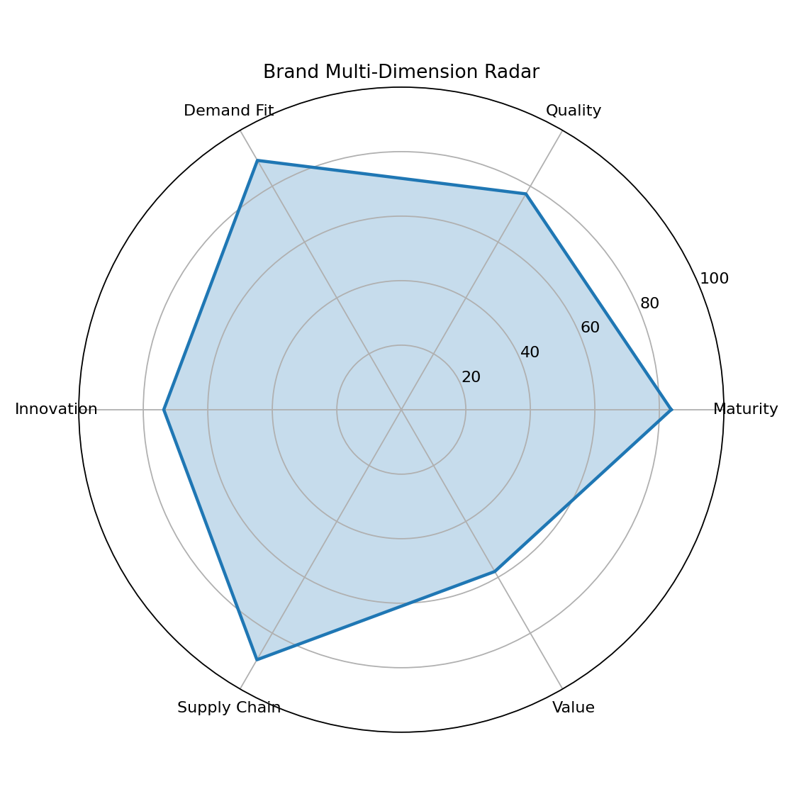

# 品牌多维度评分报告

- 综合得分：**78.9**

## 各维度得分

| 维度 | 得分 | 置信度 |
|---|---:|---|
| 品牌成熟度 | 83.67 | high |
| 产品质量 | 77.25 | medium |
| 市场需求匹配度 | 89.23 | medium |
| 创新力 | 73.65 | medium |
| 供应链可靠性 | 89.53 | low |
| 性价比 | 57.94 | medium |

## 评分说明

- 各维度得分范围 0-100，分值越高表示该维度表现越强。
- 低置信度维度在综合评分中按系数降权处理。
- 具体公式见 `docs/METRIC_DESIGN.md`。

## LLM 综合诊断（deepseek-v4-flash）

该品牌综合得分为 78.9 分，整体处于中高水平。优势维度主要体现在 供应链可靠性(89.53)、市场需求匹配度(89.23)，说明品牌在核心经营与消费端口碑方面具备一定竞争力。相对薄弱的维度为 创新力(73.65)、性价比(57.94)，建议后续优先补强相关数据监测并进行针对性优化。当前结论基于样例数据计算，仍需结合更长期销量与供应链履约数据持续校准。

## 可视化图表

